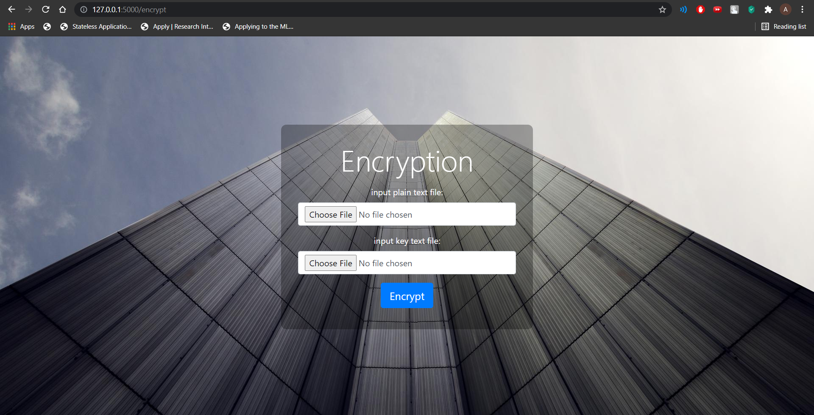
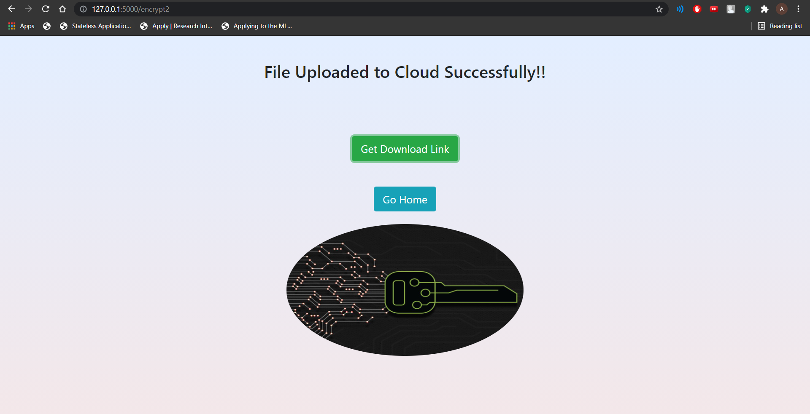
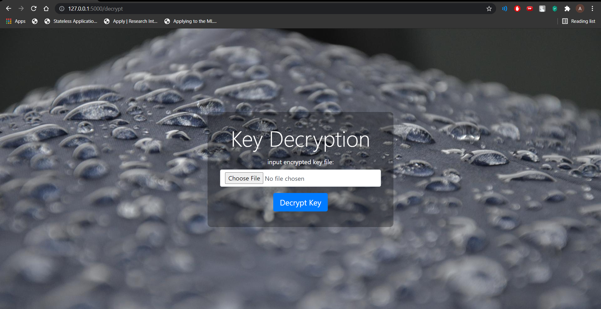

# Secure File Storage on Cloud using Hybrid Cryptography

A python based Application that encrypts file using Hybrid Cryptography (Aes and Rsa) and stores the encrypted file on the cloud securely using cloudinary.

## Feautures

* Encrypt and Decrypt file
* Encrypted file stored in cloud
* Securely add files on cloud

## Screenshots

 
 

## To run this Application
* Obtain api key from <a href ="https://cloudinary.com/">Cloudinary</a>.
* Replace Your api key and other constraints in app.py.
* Install essential packages using <b>pip install -r requirements.txt</b>
* Run the app with <b>python app.py</b>